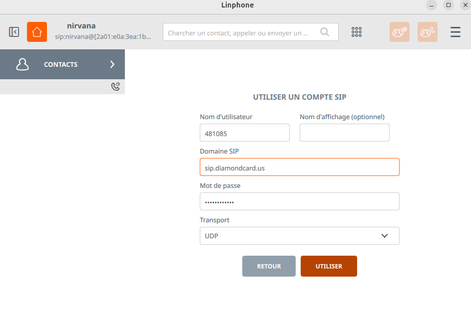

# callerid_spoofing  

Methodology to spoof caller id  

In 5 steps :)))

Purchase an account on diamondcard.us (or any sip operator that have clip no screening option)  

  
  
Download linphone and create an account  
  

Add your sip provider credentials (diamondcard for me)
  
  
 
Go to Telphony->Options and choose your callerid  
  
  
   
Pwned ! 

